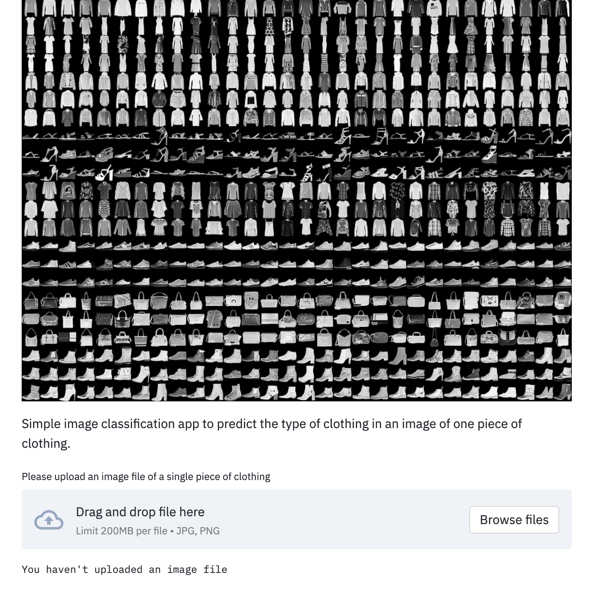
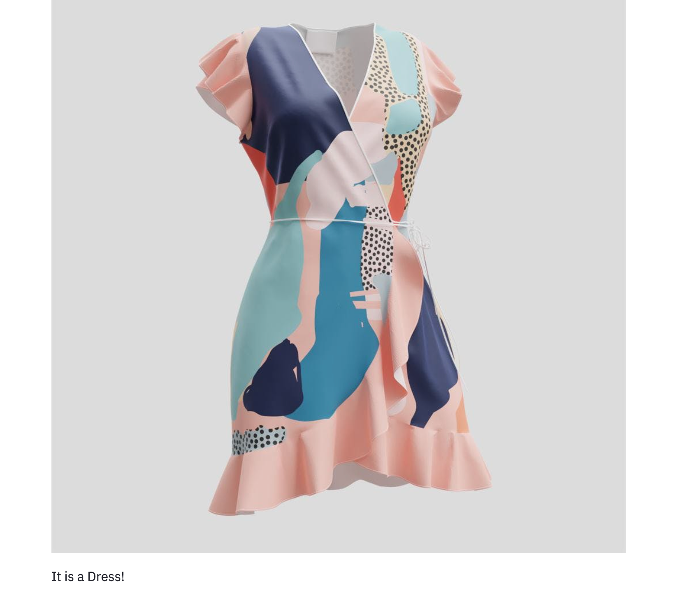

### Final Project - Data Science and Vizualisation Boot Camp - UCSD Extension

# Piece of Clothing Prediction: A simple image classification app to predict the type of clothing in an image of one piece of clothing!

This projects uses the Fashion MNIST dataset and the library TensorFlow to train a machine learning model that identifies which piece of clothing is contained in an image.

## Fashion MNIST

Fashion MNIST is a dataset that contains 70,000 grayscale images in 10 diferent categories: T-shirt/top, Trouser, Pullover, Dress, Coat, Sandal, Shirt, Sneaker, Bag and Ankle boot.

The Fashion MNIST is a slightly more challenging problem than regular MNIST. And in this project we used 60,000 images to train the model and 10,000 images to test the accurance of this model.

The model was built, trained and saved using Jupyter Notebook. The application was built in Python utilizing Streamlit and deployed using Heroku.

## The Website

The application first asks you to upload an image of your preference, in PNG. And after running it gives you as an output a prediction of which piece of clothing that image was containing.

* Imput:

* Output:

